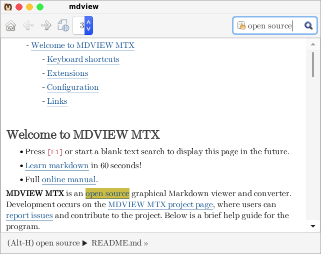

### MDVIEW MTX Readme

**MDVIEW MTX** is a graphical Markdown viewer and CLI converter supporting
the [CommonMark] specification version [0.31.2]. It runs on Linux with the
GTK+ 3 toolkit.

* Home: <http://github.com/step-/mdview>
* Wiki: <http://github.com/step-/mdview/wiki>
* Issue tracker: <http://github.com/step-/mdview/issues>

---  ---  ---  ---  ---  ---  ---  ---  ---  ---  ---  ---  ---

---  ---  ---  ---  ---  ---  ---  ---  ---  ---  ---  ---  ---

### Features

- GTK-3 Graphical Viewer for text and images (GTK-2 also available)
- Command to convert Markdown to HTML5, XHTML, text, text with ANSI or VT100 escapes
- Page and directory search
- Document and link navigation
- Hotkeys
- One-click export to web browser
- [Extensions] available
- Translation ready -- [Gettext POT file here]
- [Documentation]

Read the command [help page] and the [welcome page].

### Components

**MDVIEW MTX** utilizes the following [FOSS] components. I appreciate
the contributions these excellent software packages make to my project:

- [MD4C] -- "C Markdown parser compliant to the CommonMark specification".
- [github-markdown-css] -- "Minimal amount of CSS to replicate the GitHub style".

### Dependencies

- Unix-like OS (development and testing takes place on Linux).
- GTK-3 or GTK-2 and their dependencies.
- Pango >= 1.50, Glib >= 2.68.
- GNU make or compatible make program, and pkg-config for development.
- Meson-based build included.

### Building and installing

Read the [INSTALL] file.

### License

GNU General Public License Version 2.

### Project History

MDVIEW MTX is a continuation of the [mdview3] project. The MTX part of the
name comes from `mtx`, the three-letter prefix that I use to brand class and
function names in the source code. MTX does not mean anything in particular.

### Links

* CommonMark: <https://commonmark.org>
* github-markdown-css: <https://github.com/sindresorhus/github-markdown-css>
* MD4C: <https://github.com/mity/md4c>
* Mdview3: <http://chiselapp.com/user/jamesbond/repository/mdview3>

[0.31.2]: <https://spec.commonmark.org/0.31.2>
[mdview3]: <http://chiselapp.com/user/jamesbond/repository/mdview3>
[CommonMark]: <https://commonmark.org>
[FOSS]: <https://en.wikipedia.org/wiki/Free_and_open-source_software>
[github-markdown-css]: <https://github.com/sindresorhus/github-markdown-css>
[MD4C]: <https://github.com/mity/md4c>
[help page]: <https://github.com/step-/mdview/wiki/Command-line-options>
[welcome page]: <https://github.com/step-/mdview/blob/main/resources/welcome.md>
[Extensions]: <https://github.com/step-/mdview/wiki/extensions>
[Documentation]: <https://github.com/step-/mdview/wiki>
[Gettext POT file here]: <https://github.com/step-/mdview/blob/main/po/mdview.pot>
[INSTALL]: <https://github.com/step-/mdview/blob/main/INSTALL.md>
